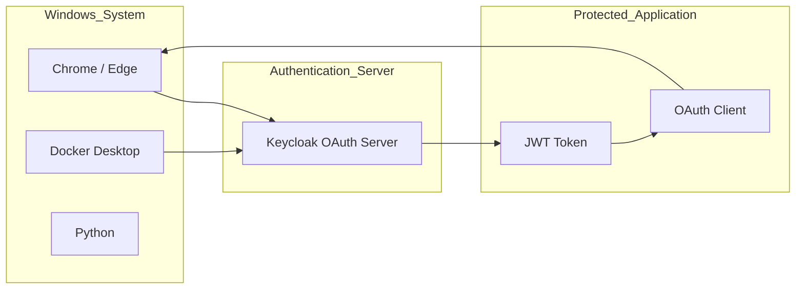
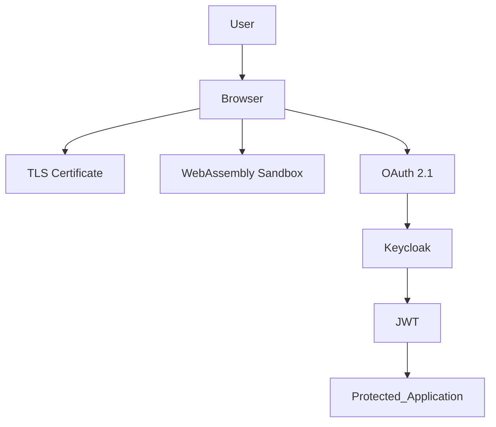
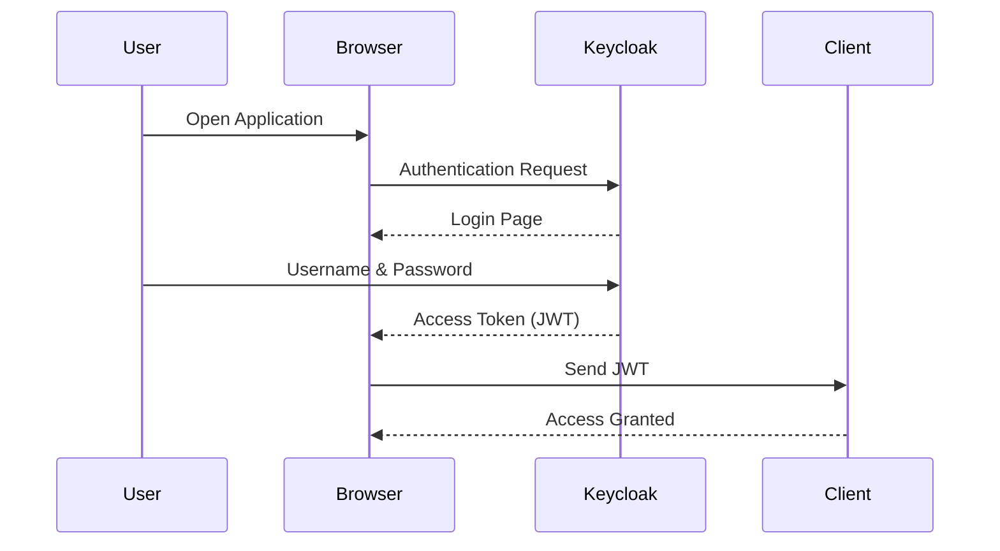
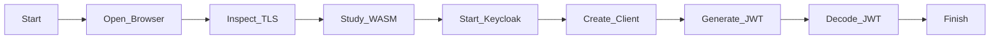

# LAB 02 - Exploration of Browser Security Mechanisms using Windows

# Browser Security Mechanisms

Exploration of Browser Security Mechanisms using Windows (TLS, WebAssembly, and OAuth 2.1)

---

# AIM

To explore modern browser security mechanisms on Windows by analyzing HTTPS/TLS connections, understanding WebAssembly (WASM) sandboxing, and demonstrating OAuth 2.1 authentication using a local Keycloak server.

---

# DESIGN STEPS

### Step 1

Install the required software on Windows.

- Google Chrome or Microsoft Edge
- Docker Desktop
- Python 3
- Keycloak (Docker Image)

### Step 2

Verify that Docker is running successfully.

### Step 3

Inspect HTTPS security using the browser Security panel.

### Step 4

Study WebAssembly (WASM) sandboxing concepts.

### Step 5

Deploy a local OAuth 2.1 authentication server using Keycloak.

### Step 6

Generate and decode a JWT access token.

---

# Architecture Diagram



---

# Browser Security Architecture



---

# OAuth 2.1 Authentication Flow



---

# Browser Security Workflow



---

# SOFTWARE REQUIRED

- Windows 10 / Windows 11
- Google Chrome or Microsoft Edge
- Docker Desktop
- Python 3
- Internet Connection
- Keycloak Docker Image

---

# EXECUTION STEPS

## Step 1

Install Docker Desktop and verify Docker is running.

---

## Step 2

Open Command Prompt or PowerShell.

Start the Keycloak server.

```bash
docker run -d --name keycloak -p 8080:8080 ^
-e KEYCLOAK_ADMIN=admin ^
-e KEYCLOAK_ADMIN_PASSWORD=admin ^
quay.io/keycloak/keycloak:latest start-dev
```

---

## Step 3

Open the browser and navigate to

```text
http://localhost:8080
```

Login using

```text
Username : admin

Password : admin
```

---

## Step 4

Create a new Realm.

```text
EnterpriseLab
```

---

## Step 5

Create a Client.

```text
Client ID

lab-client
```

Client Type

```text
OpenID Connect
```

Enable

```text
Standard Flow
```

Redirect URI

```text
http://localhost:8080/*
```

---

## Step 6

Create a Test User.

```text
Username

student1
```

Set a password and disable the Temporary Password option.

---

## Step 7

Login using the newly created user.

Generate an OAuth Access Token (JWT).

---

## Step 8

Copy the generated JWT.

Decode the payload using Python.

```python
import base64
import json

token=input("Paste JWT: ")

payload=token.split('.')[1]+'=='

print(json.dumps(json.loads(base64.urlsafe_b64decode(payload)),indent=2))
```

---

## Step 9

Inspect the decoded JWT.

Observe the following fields.

- iss
- aud
- exp
- preferred_username
- roles
- claims

---

## Step 10

Open a secure website.

Example

```text
https://www.google.com
```

Open

```text
Developer Tools (F12)

Security
```

Verify

- Secure HTTPS connection
- TLS Certificate
- Certificate Authority
- Encryption Protocol

---

## Step 11

Study WebAssembly (WASM).

Observe that:

- WASM executes inside a browser sandbox.
- Direct operating system access is restricted.
- Memory is isolated from the operating system.
- Browser permissions control resource access.

---

# OBSERVATIONS

Students should observe the following.

- Browser establishes secure HTTPS connections using TLS.
- TLS certificates verify server identity.
- OAuth 2.1 issues JWT access tokens after successful authentication.
- JWT tokens contain user identity and authorization claims.
- WebAssembly executes inside an isolated browser sandbox.
- Browser security mechanisms prevent unauthorized operating system access.

---

# SCREENSHOTS 


# RESULT

Thus, browser security mechanisms were successfully explored on Windows. HTTPS/TLS communication was verified, OAuth 2.1 authentication was demonstrated using Keycloak, JWT tokens were generated and decoded, and WebAssembly sandboxing concepts were studied to understand modern browser security architecture.
```
